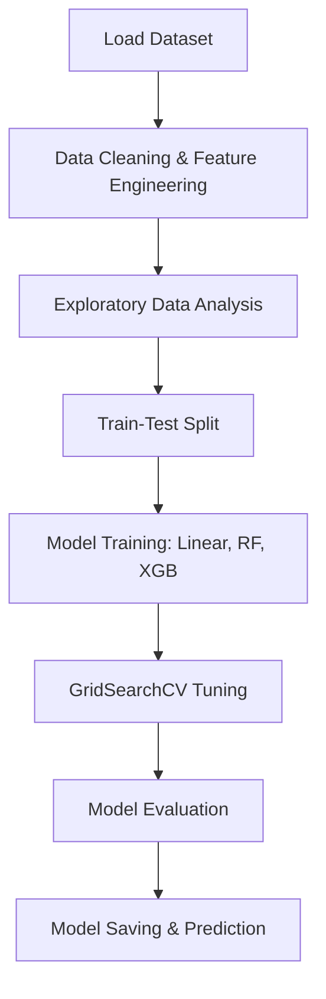

#  House Price Prediction

This project aims to predict house prices based on multiple real estate features such as square footage, location, number of bedrooms/bathrooms, and more.  
It was built as part of **TechMaven Project 1**, and follows a full machine learning pipeline from data preprocessing to model deployment.

---

##  Problem Statement

Given various attributes of houses (like location, number of bedrooms, square footage, etc.), predict the **price** of a house using machine learning techniques.

The goal is to build a **regression model** that can accurately estimate house prices using both categorical and numerical data.  
The solution includes:
- Data preprocessing  
- Visualization  
- Model building  
- Hyperparameter tuning  
- Evaluation  
- Final model saving for real-world use  

---

##  Tech Stack

- **Python**
- **Pandas**, **NumPy** – Data manipulation
- **Matplotlib**, **Seaborn** – Visualization
- **Scikit-learn** – Pipelines, models, preprocessing
- **XGBoost** – Final selected model
- **Joblib** – Model serialization

---

##  Workflow Overview



##  Exploratory Data Analysis

-  Right-skewed price distribution  

-  Features like `sqft_living`, `bathrooms`, `view` showed strong positive correlation with `price`  

-  City/location plays a significant role in pricing 


 
-  Outliers (e.g., `price = 0`) were removed  

---

##  Feature Engineering

-  Converted `date` into `year_sold`, `month_sold`  
-  Split `statezip` into `state` and `zipcode`  
-  Encoded `city` using `OneHotEncoder`  
-  Dropped `street`, `country`, and other high-cardinality or redundant fields  

---

##  Model Performance

| Model              | R² Score | RMSE        | MAE         |
|--------------------|----------|-------------|-------------|
| Linear Regression  | 0.7018   | ₹1.52 Lakh  | ₹1.01 Lakh  |
| Random Forest      | 0.6721   | ₹1.59 Lakh  | ₹1.02 Lakh  |
| XGBoost (manual)   | 0.6945   | ₹1.54 Lakh  | ₹0.98 Lakh  |
| XGBoost (tuned)    | 0.6888   | ₹1.55 Lakh  | ₹0.98 Lakh  |

 **Final Selected Model:** XGBoost with manual tuning

---

##  Feature Importance

Top contributing features (via XGBoost):

- `sqft_living`
- `bathrooms`
- `view`
- `sqft_above`
- Encoded `city`

---

##  Final Output

-  Final model saved as: `final_xgboost_model.pkl`  
-  Includes complete preprocessing pipeline (`ColumnTransformer`)  
-  Ready to predict prices on new input data  

---

##  How to Use

### 1. Install Requirements

```bash
pip install -r requirements.txt
```

### 2. Train Model

```bash
python train_model.py
```

### 3. Load Model and Predict

```python
import joblib
model = joblib.load("final_xgboost_model.pkl")
predictions = model.predict(new_data)
```

## Requirements

- pandas
- numpy
- matplotlib
- seaborn
- scikit-learn
- xgboost
- joblib

## Results Summary

- Clean ML pipeline using Pipeline, ColumnTransformer, and XGBRegressor
- Achieved R² ≈ 0.70
- Final model generalized well on test data
- Fully reusable and deployable .pkl model

## Future Improvements

- Try LightGBM or stacking models
- Add external data (school ratings, crime index, etc.)
- Deploy a web app using Streamlit
- Use SHAP or LIME for model explainability
